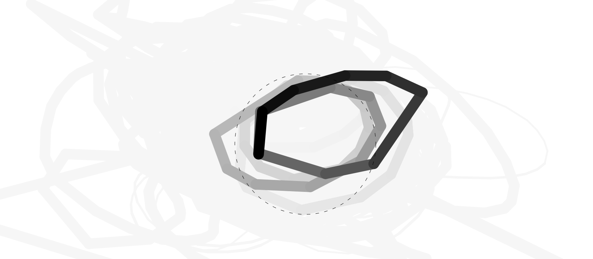

# aivct-draw-tablet-toy
A tool to help you familiarize yourself with a drawing tablet.

Literally just a circle, a canvas that draws, and a fading animation. I was getting tired of practicing in Paint.NET. 

Why did nobody else think of this before?

Using lazy-brush for smooth(er) drawing.

## Features

- Pressure sensitivity for tablets
  - You can also just use a mouse, but like... why?

## How to use

Draw circles as you normally would. Try to hit within the guideline. Now repeat until you are master.
